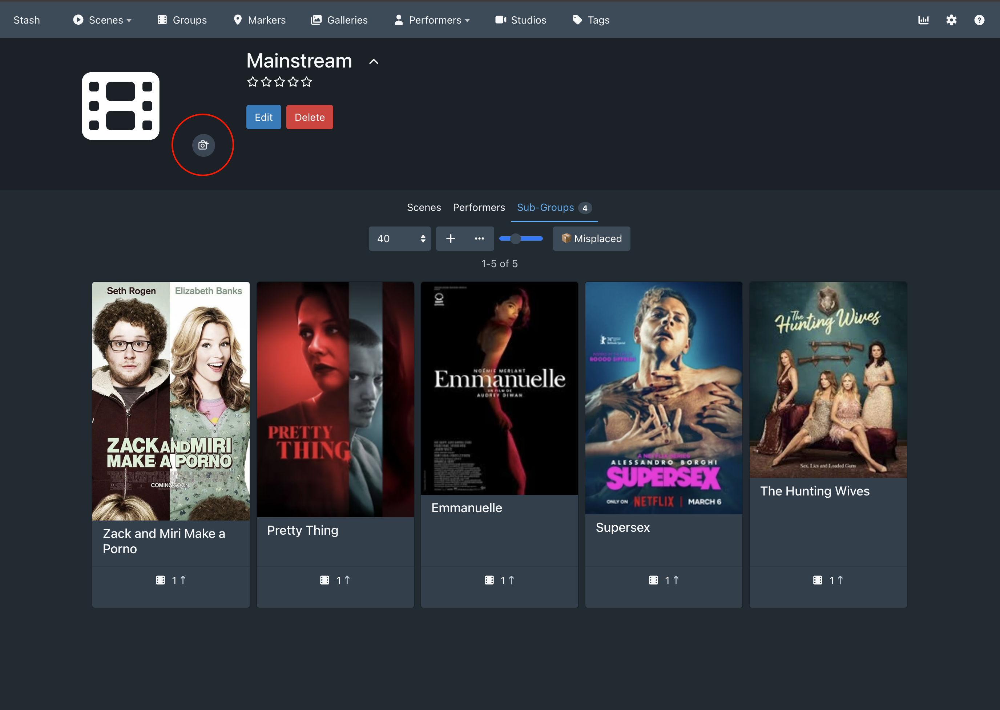
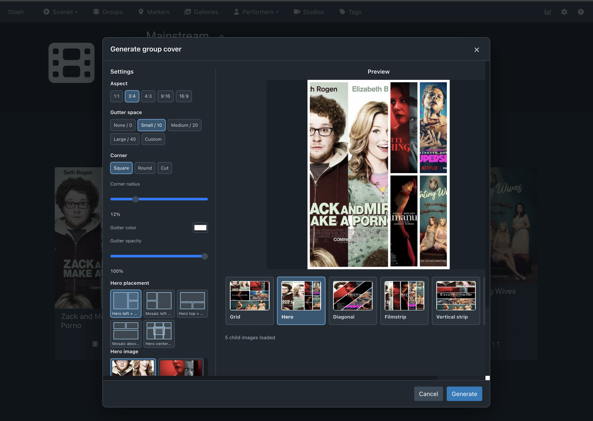

# Group Cover

Group Cover is a Stash plugin that generates a group's front image from the
front images of its child groups.

The plugin adds a camera button to the group page. Clicking it opens a modal
where the composition can be previewed and adjusted before the cover is saved.

## Screenshots

The camera button is available next to the group cover:



Clicking the button opens the layout and generation modal:



## Features

- Uses child group front images as the source material.
- Supports portrait, landscape, square, and widescreen output aspects.
- Provides configurable gutters, borders, colors, opacity, and corner styles.
- Shows browser previews before generation and uses the same composition logic
  for the final image.
- Supports these layouts:
  - **Grid**: dynamically generated row and column arrangements based on the
    number of child images.
  - **Hero**: choose a child image visually and place it left, right, top,
    bottom, or centered when enough images are available.
  - **Diagonal**: sliced diagonal composition with adjustable direction and
    angle.
  - **Filmstrip**: horizontal strip.
  - **Vertical strip**: vertical stack of images.
  - **Fan**: rotated overlapping cards with adjustable spread and spacing.

## Installation

Copy the complete plugin directory into the Stash plugins directory and make
sure the executable is present and executable:

```sh
chmod +x group-cover
```

The directory should contain:

```text
group-cover/
  group-cover
  group-cover.yml
  group-cover.js
  group-cover.css
```

Reload the Stash UI, or restart Stash if the plugin is not detected. The plugin
manifest is `group-cover.yml`; the executable is a raw-interface plugin using
the standard Stash plugin input and output protocol.

## Building From Source

The backend is written in Go and requires Go 1.25 or newer. From this
directory:

```sh
go mod download
go build -o group-cover .
chmod +x group-cover
```

The backend uses `github.com/disintegration/imaging` for high-quality resizing
and rotation.

The frontend consists of `group-cover.js` and `group-cover.css`, which are
loaded by the plugin manifest.

## Distribution Builds

Build packages for the supported Stash platforms with:

```sh
make package
```

This creates a plugin directory and ZIP archive for each target under `dist/`:

- `darwin-amd64`
- `darwin-arm64`
- `linux-amd64`
- `linux-arm64`
- `windows-amd64`
- `freebsd-amd64`

Each package contains the platform-specific `group-cover` executable and the
manifest, frontend assets, license, and README. The executable is built with
`CGO_ENABLED=0`, so no target-platform C compiler is required.

## Publishing A Package Source

Stash package sources are YAML indexes hosted at a public URL. This repository
includes a GitHub Actions workflow at `.github/workflows/publish-pages.yml`
that publishes one index containing a separate package entry for each platform.

To enable publishing:

1. In GitHub, open **Settings > Pages** for the repository.
2. Set the Pages source to **GitHub Actions**.
3. Push a version tag such as `v0.1.0`.
4. Add this source URL in Stash:

```text
https://gcrosemond.github.io/GroupCover/index.yml
```

The source lists one package per platform. Install the entry matching the host
platform; Stash does not automatically filter entries by operating system. The
package manager verifies the ZIP using the SHA-256 value in the index. The same
site can be generated locally with:

```sh
make site VERSION=0.1.0
```

The generated `site/` directory is ready to publish as a static site.

## Usage

1. Open a group that has child groups with front images.
2. Click the camera button near the group image.
3. Select an aspect ratio and gutter settings.
4. Select a layout from the visual layout strip.
5. For Grid, choose one of the dynamically generated schematic arrangements.
6. For Hero, choose a placement and click the child image to use as the hero.
7. Review the main preview and click **Generate**.

Child groups without usable front images are omitted. Generation fails when no
child images can be loaded.

## Development Checks

Run the frontend syntax check and Go tests before installing a rebuilt version:

```sh
node --check group-cover.js
GOCACHE=/tmp/group-cover-gocache go test ./...
GOCACHE=/tmp/group-cover-gocache go build -o group-cover .
```

Use `make validate` for the equivalent JavaScript syntax check, Go tests, and
`go vet` check. Use `make clean` to remove local and distribution builds.

There are currently no Go unit tests in this plugin, so `go test ./...`
primarily verifies that the backend compiles and its package is valid.
